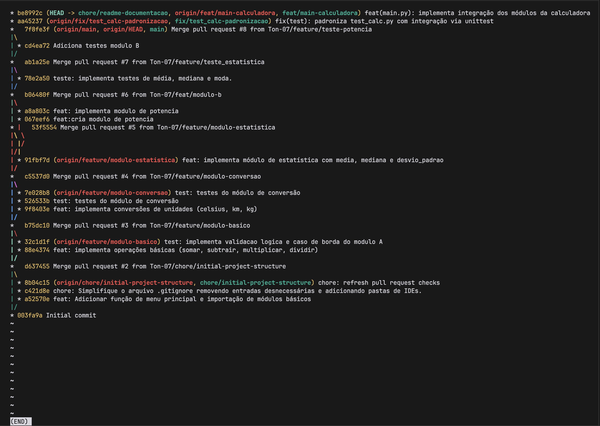

# Calculadora Modular GCS

Repositório destinado ao Laboratório Colaborativo da disciplina de Gerência de Configuração de Software. [cite_start]O objetivo deste projeto é desenvolver colaborativamente uma Calculadora Modular em Python utilizando o **GitHub Flow**.

## Equipe
Os módulos foram divididos da seguinte maneira:

- **Mantenedor:** Cleiton Pinheiro Rodrigues
- **Desenvolvedor Módulo A (Básico):** Jonathan Pereira do Amaral
- **Desenvolvedor Módulo B (Potência):** Gabriel Mattos de Aquino
- **Desenvolvedor Módulo C (Percentual):** Pedro Lucas de Souza Cremonini
- **Desenvolvedor Módulo D (Estatística):** Angelo Antonio
- **Desenvolvedor Módulo E (Conversão):** Yan

## Link do Repositório
[https://github.com/Ton-07/calculadora-gcs](https://github.com/Ton-07/calculadora-gcs)

## Histórico Git



## Como Executar o Projeto

**1. Para rodar a calculadora (menu principal):**
O programa está preparado para carregar os módulos gradualmente. Módulos ainda não integrados não impedirão o funcionamento dos demais.
```bash
python main.py